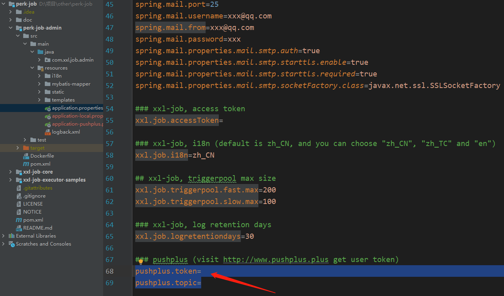
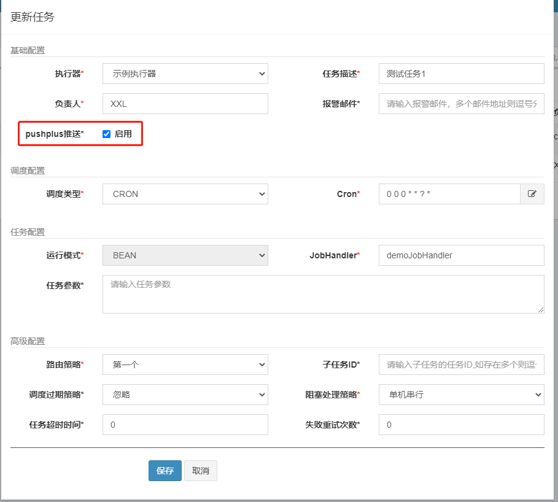
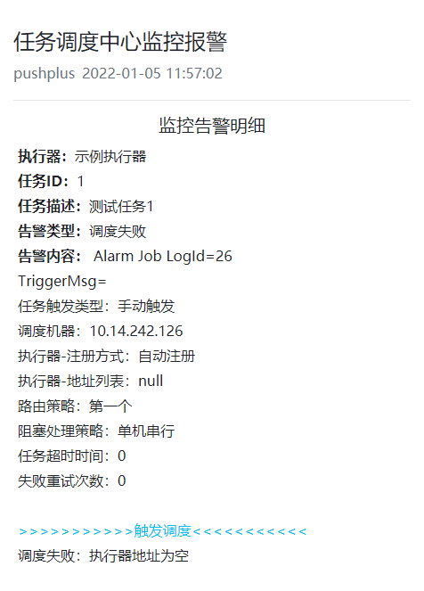

# perk-job
在xxl-job基础上增加了pushplus推送告警功能。仅修改调度器管理界面系统，没有修改调度器逻辑，保留xxl-job核心功能，不影响官方的版本迭代升级。

> xxl-job项目参考官方仓库：https://github.com/xuxueli/xxl-job

## 修改点
1. 基于xxl-job V3.1.2-SNAPSHOT官方源码修改。
2. xxl_job_info表中新增字段alarm_pushplus字段。用于存储单个任务是否开启pushplus推送。
3. 新增PushplusJobAlarm.java类，实现pushplus告警逻辑。
4. 任务详情页面增加“pushplus推送”开关，可以控制单个任务是否启用pushplus推送。
5. application.properties文件增加pushplus.token和pushplus.topic两个参数。具体配置参数值访问: https://www.pushplus.plus/ 获取。

## 使用方式
1. 执行新增字段SQL语句。
```
ALTER TABLE `xxl_job_info`
    ADD COLUMN `alarm_pushplus` int NULL DEFAULT 0 COMMENT '是否启用pushplus推送；0否，1是' AFTER `alarm_email`;
```
2. 从pushplus官方（https://www.pushplus.plus/ ）获取自己的token，如需要多人接收还需创建群组，获取群组编码。
3. 在application.properties中pushplus.token填入自己的token。如需群发在pushplus.topic填入创建的群组编码。



5. 编译perk-job-admin项目，打成jar包。
6. 运行项目，命令：nohup java -jar perk-job-admin-3.1.2-SNAPSHOT.jar > /dev/null 2>&1&
7. 访问系统，正常创建需要的定时任务。在任务详情页面勾选“pushplus推送”选项。



9. 当job执行时发生异常，微信上即可收到来自“pushplus 推送加”公众号上的告警消息。



***

<p align="center" >
    
    <h3 align="center">XXL-JOB</h3>
    <p align="center">
        XXL-JOB, a distributed task scheduling framework.
        <br>
        <a href="https://www.xuxueli.com/xxl-job/"><strong>-- Home Page --</strong></a>
        <br>
        <br>
        <a href="https://github.com/xuxueli/xxl-job/actions">
            
        </a>
        <a href="https://maven-badges.herokuapp.com/maven-central/com.xuxueli/xxl-job/">
            
        </a>
        <a href="https://github.com/xuxueli/xxl-job/releases">
         
        </a>
        <a href="https://github.com/xuxueli/xxl-job/">
            
        </a>
        <a href="https://hub.docker.com/r/xuxueli/xxl-job-admin/">
            
        </a>
        <a href="http://www.gnu.org/licenses/gpl-3.0.html">
         
        </a>
        <a href="https://www.xuxueli.com/page/donate.html">
           
        </a>
    </p>
</p>


## Introduction
XXL-JOB is a distributed task scheduling framework. 
It's core design goal is to develop quickly and learn simple, lightweight, and easy to expand. 
Now, it's already open source, and many companies use it in production environments, real "out-of-the-box".

XXL-JOB是一个分布式任务调度平台，其核心设计目标是开发迅速、学习简单、轻量级、易扩展。现已开放源代码并接入多家公司线上产品线，开箱即用。


## Documentation
- [中文文档](https://www.xuxueli.com/xxl-job/)
- [English Documentation](https://www.xuxueli.com/xxl-job/en/)


## Communication    
- [社区交流](https://www.xuxueli.com/page/community.html)


## Features
- 1、简单：支持通过Web页面对任务进行CRUD操作，操作简单，一分钟上手；
- 2、动态：支持动态修改任务状态、启动/停止任务，以及终止运行中任务，即时生效；
- 3、调度中心HA（中心式）：调度采用中心式设计，“调度中心”自研调度组件并支持集群部署，可保证调度中心HA；
- 4、执行器HA（分布式）：任务分布式执行，任务"执行器"支持集群部署，可保证任务执行HA；
- 5、注册中心: 执行器会周期性自动注册任务, 调度中心将会自动发现注册的任务并触发执行。同时，也支持手动录入执行器地址；
- 6、弹性扩容缩容：一旦有新执行器机器上线或者下线，下次调度时将会重新分配任务；
- 7、触发策略：提供丰富的任务触发策略，包括：Cron触发、固定间隔触发、固定延时触发、API（事件）触发、人工触发、父子任务触发；
- 8、调度过期策略：调度中心错过调度时间的补偿处理策略，包括：忽略、立即补偿触发一次等；
- 9、阻塞处理策略：调度过于密集执行器来不及处理时的处理策略，策略包括：单机串行（默认）、丢弃后续调度、覆盖之前调度；
- 10、任务超时控制：支持自定义任务超时时间，任务运行超时将会主动中断任务；
- 11、任务失败重试：支持自定义任务失败重试次数，当任务失败时将会按照预设的失败重试次数主动进行重试；其中分片任务支持分片粒度的失败重试；
- 12、任务失败告警；默认提供邮件方式失败告警，同时预留扩展接口，可方便的扩展短信、钉钉等告警方式；
- 13、路由策略：执行器集群部署时提供丰富的路由策略，包括：第一个、最后一个、轮询、随机、一致性HASH、最不经常使用、最近最久未使用、故障转移、忙碌转移等；
- 14、分片广播任务：执行器集群部署时，任务路由策略选择"分片广播"情况下，一次任务调度将会广播触发集群中所有执行器执行一次任务，可根据分片参数开发分片任务；
- 15、动态分片：分片广播任务以执行器为维度进行分片，支持动态扩容执行器集群从而动态增加分片数量，协同进行业务处理；在进行大数据量业务操作时可显著提升任务处理能力和速度。
- 16、故障转移：任务路由策略选择"故障转移"情况下，如果执行器集群中某一台机器故障，将会自动Failover切换到一台正常的执行器发送调度请求。
- 17、任务进度监控：支持实时监控任务进度；
- 18、Rolling实时日志：支持在线查看调度结果，并且支持以Rolling方式实时查看执行器输出的完整的执行日志；
- 19、GLUE：提供Web IDE，支持在线开发任务逻辑代码，动态发布，实时编译生效，省略部署上线的过程。支持30个版本的历史版本回溯。
- 20、脚本任务：支持以GLUE模式开发和运行脚本任务，包括Shell、Python、NodeJS、PHP、PowerShell等类型脚本;
- 21、命令行任务：原生提供通用命令行任务Handler（Bean任务，"CommandJobHandler"）；业务方只需要提供命令行即可；
- 22、任务依赖：支持配置子任务依赖，当父任务执行结束且执行成功后将会主动触发一次子任务的执行, 多个子任务用逗号分隔；
- 23、一致性：“调度中心”通过DB锁保证集群分布式调度的一致性, 一次任务调度只会触发一次执行；
- 24、自定义任务参数：支持在线配置调度任务入参，即时生效；
- 25、调度线程池：调度系统多线程触发调度运行，确保调度精确执行，不被堵塞；
- 26、数据加密：调度中心和执行器之间的通讯进行数据加密，提升调度信息安全性；
- 27、邮件报警：任务失败时支持邮件报警，支持配置多邮件地址群发报警邮件；
- 28、推送maven中央仓库: 将会把最新稳定版推送到maven中央仓库, 方便用户接入和使用;
- 29、运行报表：支持实时查看运行数据，如任务数量、调度次数、执行器数量等；以及调度报表，如调度日期分布图，调度成功分布图等；
- 30、全异步：任务调度流程全异步化设计实现，如异步调度、异步运行、异步回调等，有效对密集调度进行流量削峰，理论上支持任意时长任务的运行；
- 31、跨语言：调度中心与执行器提供语言无关的 RESTful API 服务，第三方任意语言可据此对接调度中心或者实现执行器。除此之外，还提供了 “多任务模式”和“httpJobHandler”等其他跨语言方案；
- 32、国际化：调度中心支持国际化设置，提供中文、英文两种可选语言，默认为中文；
- 33、容器化：提供官方docker镜像，并实时更新推送dockerhub，进一步实现产品开箱即用；
- 34、线程池隔离：调度线程池进行隔离拆分，慢任务自动降级进入"Slow"线程池，避免耗尽调度线程，提高系统稳定性；
- 35、用户管理：支持在线管理系统用户，存在管理员、普通用户两种角色；
- 36、权限控制：执行器维度进行权限控制，管理员拥有全量权限，普通用户需要分配执行器权限后才允许相关操作；


## Development
于2015年中，我在github上创建XXL-JOB项目仓库并提交第一个commit，随之进行系统结构设计，UI选型，交互设计……

于2015-11月，XXL-JOB终于RELEASE了第一个大版本V1.0， 随后我将之发布到OSCHINA，XXL-JOB在OSCHINA上获得了@红薯的热门推荐，同期分别达到了OSCHINA的“热门动弹”排行第一和git.oschina的开源软件月热度排行第一，在此特别感谢红薯，感谢大家的关注和支持。

于2015-12月，我将XXL-JOB发表到我司内部知识库，并且得到内部同事认可。

于2016-01月，我司展开XXL-JOB的内部接入和定制工作，在此感谢袁某和尹某两位同事的贡献，同时也感谢内部其他给与关注与支持的同事。

于2017-05-13，在上海举办的 "[第62期开源中国源创会](https://www.oschina.net/event/2236961)" 的 "放码过来" 环节，我登台对XXL-JOB做了演讲，台下五百位在场观众反响热烈（[图文回顾](https://www.oschina.net/question/2686220_2242120) ）。

于2017-10-22，又拍云 Open Talk 联合 Spring Cloud 中国社区举办的 "[进击的微服务实战派上海站](https://opentalk.upyun.com/303.html)"，我登台对XXL-JOB做了演讲，现场观众反响热烈并在会后与XXL-JOB用户热烈讨论交流。

于2017-12-11，XXL-JOB有幸参会《[InfoQ ArchSummit全球架构师峰会](http://bj2017.archsummit.com/)》，并被拍拍贷架构总监"杨波老师"在专题 "[微服务原理、基础架构和开源实践](http://bj2017.archsummit.com/training/2)" 中现场介绍。

于2017-12-18，XXL-JOB参与"[2017年度最受欢迎中国开源软件](http://www.oschina.net/project/top_cn_2017?sort=1)"评比，在当时已录入的约九千个国产开源项目中角逐，最终进入了前30强。

于2018-01-15，XXL-JOB参与"[2017码云最火开源项目](https://www.oschina.net/news/92438/2017-mayun-top-50)"评比，在当时已录入的约六千五百个码云项目中角逐，最终进去了前20强。

于2018-04-14，iTechPlus在上海举办的 "[2018互联网开发者大会](http://www.itdks.com/eventlist/detail/2065)"，我登台对XXL-JOB做了演讲，现场观众反响热烈并在会后与XXL-JOB用户热烈讨论交流。

于2018-05-27，在上海举办的 "[第75期开源中国源创会](https://www.oschina.net/event/2278742)" 的 "架构" 主题专场，我登台进行“基础架构与中间件图谱”主题演讲，台下上千位在场观众反响热烈（[图文回顾](https://www.oschina.net/question/3802184_2280606) ）。

于2018-12-05，XXL-JOB参与"[2018年度最受欢迎中国开源软件](https://www.oschina.net/project/top_cn_2018?sort=1)"评比，在当时已录入的一万多个开源项目中角逐，最终排名第19名。

于2019-12-10，XXL-JOB参与"[2019年度最受欢迎中国开源软件](https://www.oschina.net/project/top_cn_2019)"评比，在当时已录入的一万多个开源项目中角逐，最终排名"开发框架和基础组件类"第9名。

于2020-11-16，XXL-JOB参与"[2020年度最受欢迎中国开源软件](https://www.oschina.net/project/top_cn_2020)"评比，在当时已录入的一万多个开源项目中角逐，最终排名"开发框架和基础组件类"第8名。

> 我司大众点评目前已接入XXL-JOB，内部别名《Ferrari》（Ferrari基于XXL-JOB的V1.1版本定制而成，新接入应用推荐升级最新版本）。
据最新统计, 自2016-01-21接入至2017-12-01期间，该系统已调度约100万次，表现优异。新接入应用推荐使用最新版本，因为经过数十个版本的更新，系统的任务模型、UI交互模型以及底层调度通讯模型都有了较大的优化和提升，核心功能更加稳定高效。
  